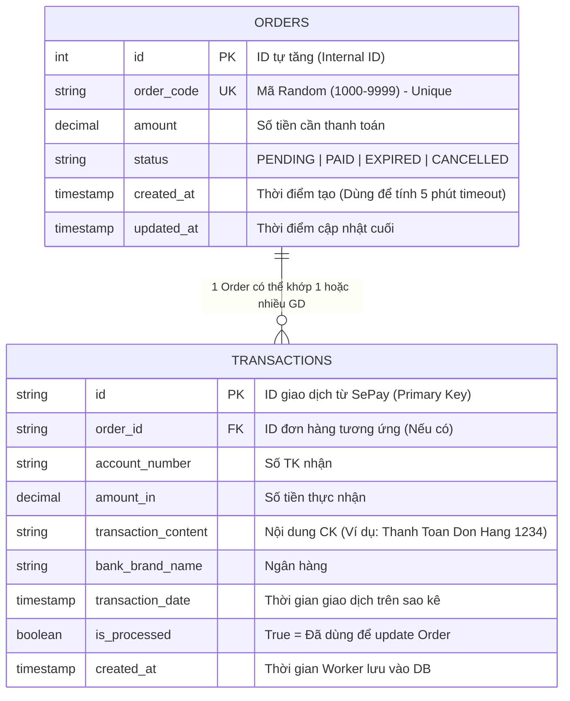
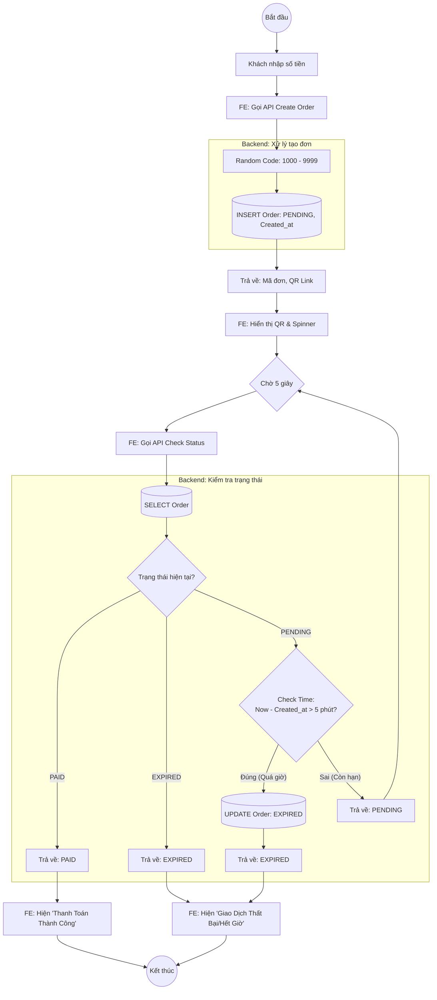
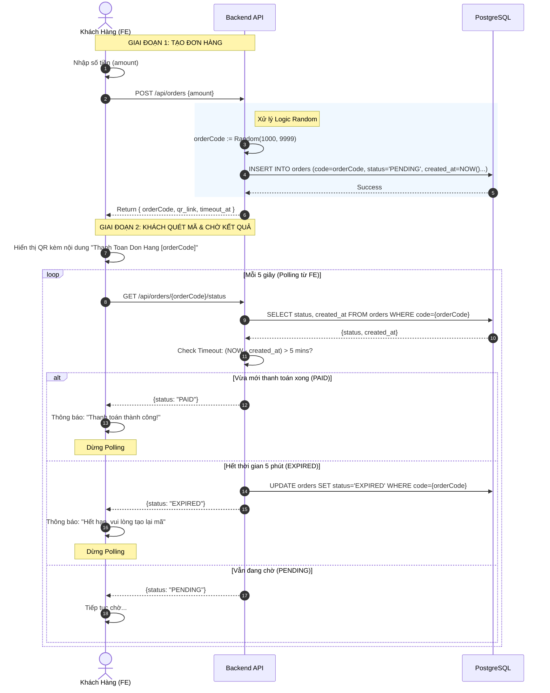
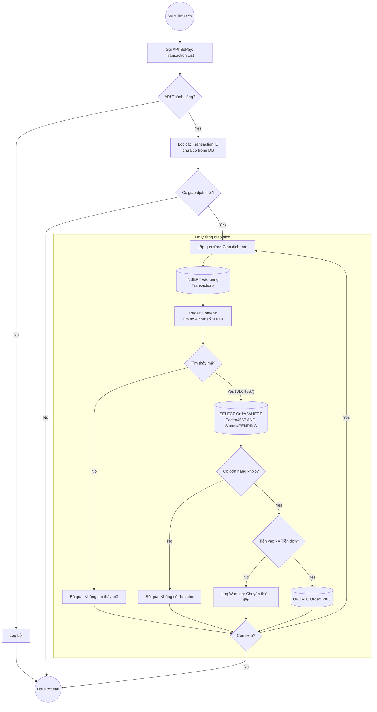
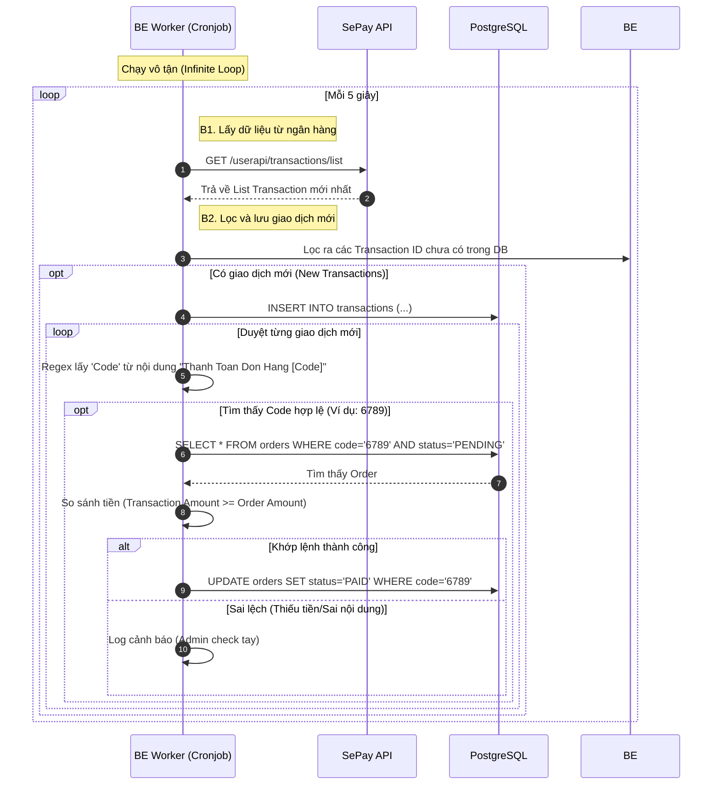

# Demo Thanh Toán SePay , Thông Báo Qua Telegram
**Giao Diện Trang Chủ**

[](https://postimg.cc/7fnf8N17)

**Giao Diện Trang Thanh Toán**

[](https://postimg.cc/R6WX2Fjp)

**Tiến Hành Thanh Toán Bằng Việc Quét Mã VietQR**

[](https://postimg.cc/XZpP6Q5c)


**Thông Báo Qua Telegram**

[](https://postimg.cc/TLbnrD8x)


## Tài liệu tham khảo

- **Tạo QR Code Online chuẩn VietQR:**  [qr.sepay.vn](https://qr.sepay.vn/)
- **Tạo API Token:**  [docs.sepay.vn/tao-api-token.html](https://docs.sepay.vn/tao-api-token.html)
- **Hướng dẫn lập trình cổng thanh toán miễn phí:**  [sepay.vn/lap-trinh-cong-thanh-toan.html](https://sepay.vn/lap-trinh-cong-thanh-toan.html)


## Công Nghệ Sử Dụng

- **Frontend (FE):** ReactJS – Giao diện đơn giản, trực quan, dễ sử dụng.
- **Backend (BE):** Node.js & Express.js – Xử lý logic, kết nối SePay API, thao tác với database.
- **Database:** PostgreSQL – Lưu trữ thông tin đơn hàng và giao dịch.


## Cấu trúc thư mục dự án

```text
sepay-payment-app/
├── database/                   # Chứa câu lệnh SQL
│   └── schema.sql
├── server/                     # Backend (Node.js + Express)
│   ├── .env                    # Biến môi trường (Token, DB Config)
│   ├── config/
│   │   └── db.js               # Kết nối PostgreSQL
│   ├── controllers/
│   │   └── orderController.js  # Logic xử lý đơn hàng
│   ├── worker.js               # Worker chạy ngầm (Sync SePay)
│   ├── index.js                # Entry point của API Server
│   └── package.json
└── client/                     # Frontend (ReactJS - Vite)
    ├── src/
    │   ├── components/
    │   │   ├── Home.jsx
    │   │   └── Payment.jsx
    │   ├── App.jsx
    │   └── main.jsx
    └── package.json
```

## Hướng dẫn khởi tạo dự án & cài đặt package

### Backend (BE)

Chạy lệnh sau trong thư mục `server` để cài đặt các package cần thiết:

```bash
npm install express pg cors dotenv axios
```

### Frontend (FE)

Khởi tạo dự án React + TypeScript với Vite:

```bash
npm create vite@latest .
```

Chọn các tuỳ chọn:
- **Framework:** React
- **Variant:** TypeScript

## Ý Tưởng Website

1. **Trang chủ (Home):**
     - Phía trên: Tiêu đề, mô tả ngắn về dịch vụ.
     - Phía dưới: Ô nhập số tiền (chỉ nhận số > 2000 VND, không âm).
     - Nút "Đặt Hàng" để tạo đơn.

2. **Giao diện thanh toán:**
     - Hiển thị QR Code VietQR (tạo qua API SePay).
     - Thông tin số tài khoản, ngân hàng, nội dung chuyển khoản: `Thanh Toán Đơn Hàng XXX`
     - Vòng tròn chờ thanh toán (timeout 5 phút).

3. **Kiểm tra trạng thái thanh toán:**
     - Backend gọi API SePay lấy danh sách giao dịch:
         `https://my.sepay.vn/userapi/transactions/list?account_number=SO_TAI_KHOAN&limit=20`
     - Token API lấy từ SePay.
     - Cứ mỗi 5 giây, backend gọi lại API, lưu các giao dịch mới vào bảng `transactions`.
     - So sánh các giao dịch mới với nội dung chuyển khoản, lọc ra mã đơn hàng (XXX).
     - Nếu tìm thấy giao dịch hợp lệ (đúng số tiền, đúng nội dung), cập nhật trạng thái đơn hàng thành "PAID" và trả về FE.

## Hướng Dẫn Tích Hợp

### 1. Tạo QR Code VietQR

- Sử dụng API:
    `https://qr.sepay.vn/img?acc=SO_TAI_KHOAN&bank=NGAN_HANG&amount=SO_TIEN&des=NOI_DUNG&template=TEMPLATE&download=DOWNLOAD`
    - `SO_TAI_KHOAN`: Số tài khoản ngân hàng.
    - `NGAN_HANG`: Mã ngân hàng (xem [danh sách](https://qr.sepay.vn/banks.json)).
    - `SO_TIEN`: Số tiền cần chuyển.
    - `NOI_DUNG`: Nội dung chuyển khoản (ví dụ: Thanh Toán Đơn Hàng 456).
    - `TEMPLATE`: Kiểu QR (để trống, `compact`, `qronly`).
    - `DOWNLOAD`: `true` để tải về.

- Ví dụ QR:
    `https://qr.sepay.vn/img?bank=TPBank&acc=10367909181&template=compact&amount=2000&des=Thanh%20Toan%20Don%20Hang%20456`

### 2. Tạo API Token

- Đăng nhập SePay, tạo API Token tại: [docs.sepay.vn/tao-api-token.html](https://docs.sepay.vn/tao-api-token.html)
- Sử dụng token này để xác thực khi gọi API lấy giao dịch.

### 3. Lấy danh sách giao dịch từ SePay

- API lấy giao dịch:
    `https://my.sepay.vn/userapi/transactions/list?account_number=10367909181&limit=20`
    - `account_number`: Số tài khoản nhận tiền.
    - `limit`: Số lượng giao dịch lấy về.

- Kết quả trả về:
    ```json
    {
            "status": 200,
            "error": null,
            "messages": { "success": true },
            "transactions": [
                    {
                            "id": "31311033",
                            "bank_brand_name": "TPBank",
                            "account_number": "10367909181",
                            "transaction_date": "2025-11-19 13:26:39",
                            "amount_in": "2000.00",
                            "transaction_content": "Thanh Toan Don Hang 456",
                            ...
                    }
            ]
    }
    ```

### 4. Lưu giao dịch vào Database

- Tạo bảng `transactions` trong PostgreSQL với các trường: `id`, `bank_brand_name`, `account_number`, `transaction_date`, `amount_in`, `transaction_content`, `bank_account_id`, ...
- Khi có giao dịch mới, lưu vào bảng.
- So sánh nội dung chuyển khoản (`transaction_content`) để lấy mã đơn hàng (XXX).
- Nếu mã đơn hàng hợp lệ, cập nhật trạng thái đơn hàng thành "PAID".

### 5. Kiểm tra trạng thái đơn hàng

- FE gọi API backend để kiểm tra trạng thái đơn hàng (polling mỗi 5 giây).
- Nếu đơn hàng đã "PAID", hiển thị thông báo thành công.
- Nếu hết thời gian (5 phút), chuyển trạng thái "EXPIRED", hiển thị thông báo hết hạn.

## Lưu Ý Triển Khai

- Đảm bảo kiểm tra dữ liệu đầu vào ở cả FE và BE.
- Sử dụng prepared statement khi thao tác với database để tránh SQL Injection.
- Bảo mật API Token, không để lộ ra ngoài.
- Xử lý timeout, trạng thái đơn hàng chính xác theo luồng nghiệp vụ.

---

## Sequence Diagram Cập Nhật

### 1. Thiết kế Cơ sở dữ liệu (Database Schema)

### 2. Flowchart & Sequence Diagrams

####  Sơ đồ 1: Luồng Chính (Tạo đơn & Người dùng chờ phản hồi)

Sơ đồ này tập trung vào trải nghiệm người dùng và việc Frontend giao tiếp với Backend.

Flowchart :


Sequence Diagram


#### Sơ đồ 2: Luồng Worker (Hệ thống chạy ngầm đồng bộ)

Flowchart :


